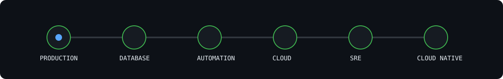

<div align="center">



<br/>

### `11+ years in production systems → building deeper into infrastructure internals`

**Senior Infrastructure Engineer · SRE · Kubernetes · Data Infrastructure · MLOps**

</div>

---

## `AJ-here@control-plane:~$ kubectl get engineer`

```text
NAME       EXPERIENCE   CURRENT-FOCUS                         STATUS
AJ-here    11+ years    Kubernetes · PostgreSQL · SRE        BUILDING
```

I work on enterprise production systems where databases, middleware, infrastructure, authentication, automation, and customer-critical applications meet.

My background includes supporting large-scale ERP environments, Oracle databases, Linux systems, middleware platforms, production incidents, infrastructure automation, and technical leadership.

Now I'm going deeper into **Kubernetes internals, PostgreSQL, Site Reliability Engineering, Data Infrastructure, Distributed Systems, Open Source, and MLOps.**



---

## `kubectl describe engineer AJ-here`

```yaml
apiVersion: engineering.dev/v1
kind: InfrastructureEngineer

metadata:
  name: AJ-here

spec:

  experience: 11+ years

  production:
    systems:
      - Linux
      - Enterprise ERP
      - Oracle Database
      - PostgreSQL
      - WebLogic
      - Tomcat

  infrastructure:
    - AWS
    - OCI
    - Docker
    - Kubernetes
    - Terraform
    - Ansible

  automation:
    - Python
    - Shell
    - Jenkins
    - GitHub Actions

  observability:
    - Prometheus
    - Grafana
    - Datadog
    - OpenSearch

  learning:
    - Kubernetes Internals
    - Go
    - Distributed Systems
    - PostgreSQL Internals
    - MLOps

status:

  phase: BUILDING

  mission:
    "Understand systems deeply. Build reliable infrastructure. Contribute upstream."
```

---

## `cat /etc/current-mission`

```text
[01] Contribute meaningful fixes to Kubernetes.

[02] Build tools that solve real production reliability problems.

[03] Develop deeper PostgreSQL and Data Infrastructure expertise.

[04] Build production-grade Kubernetes and MLOps systems.

[05] Move from operating infrastructure platforms
     to understanding and improving how they work internally.
```

---

---

## `systemctl status engineering-evolution.service`

```text
● engineering-evolution.service

   Loaded: loaded
   Active: active (running)

   Enterprise Applications
              │
              ▼
      Production Systems
              │
              ▼
       Database Engineering
              │
              ▼
    Infrastructure Automation
              │
              ▼
          Cloud & DevOps
              │
              ▼
    Site Reliability Engineering
              │
              ▼
    Cloud Native Infrastructure
              │
              ▼
    Data Infrastructure + MLOps

   Current State: ACTIVE DEVELOPMENT
```

---

## `git log --oneline --currently-learning`

```text
a82f11c  studying Kubernetes controllers and reconciliation loops

91b7e02  exploring Kubernetes scheduler internals

63c1af9  learning Go for cloud-native engineering

44ae812  analyzing PostgreSQL execution plans

19fc721  studying distributed systems failure patterns

08de112  building MLOps infrastructure on Kubernetes
```

---

## `./engineering-principles.sh`

```bash
while systems_are_running
do

    automate_repetitive_work

    measure_before_optimizing

    design_for_failure

    debug_from_evidence

    reduce_operational_complexity

    learn_from_incidents

    contribute_upstream

done
```

---

## `git contribution-graph --animate`

<div align="center">


</div>

---

## `curl localhost:8080/health`

```json
{
  "engineer": "AJ-here",
  "status": "healthy",
  "production_experience": "11+ years",
  "focus": [
    "Kubernetes",
    "Site Reliability Engineering",
    "PostgreSQL",
    "Data Infrastructure",
    "Distributed Systems",
    "MLOps",
    "Open Source"
  ],
  "objective": "Build reliable systems and contribute upstream."
}
```

---

<div align="center">

### `$ uptime`

**11+ years in production systems. Still learning. Still debugging. Still building.**

<br/>

`$ git commit -m "understand systems. build reliability. contribute upstream."`

</div>
